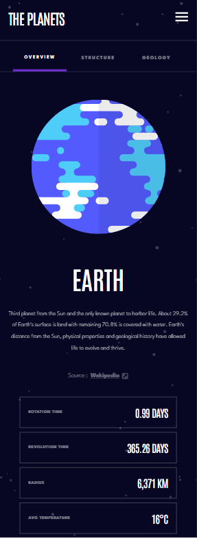
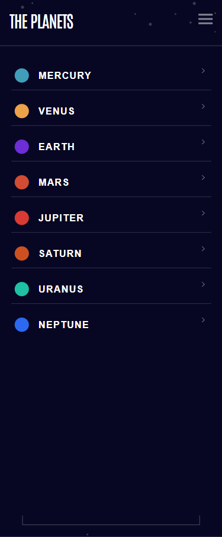
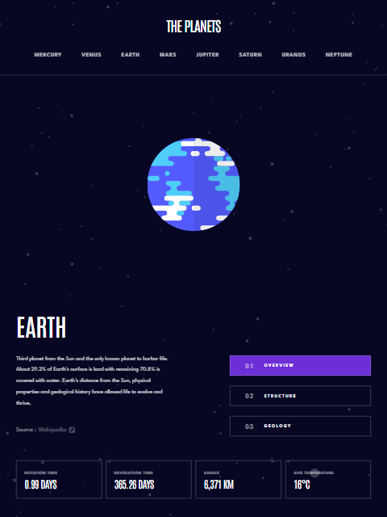

# Frontend Mentor - Planets fact site solution

This is a solution to the [Planets fact site challenge on Frontend Mentor](https://www.frontendmentor.io/challenges/planets-fact-site-gazqN8w_f). Frontend Mentor challenges help you improve your coding skills by building realistic projects.

## Table of contents

- [Overview](#overview)
  - [The challenge](#the-challenge)
  - [Screenshot](#screenshot)
  - [Links](#links)
- [My process](#my-process)
  - [Built with](#built-with)
  - [What I learned](#what-i-learned)
  - [Continued development](#continued-development)
  - [Useful resources](#useful-resources)
- [Author](#author)
- [Acknowledgments](#acknowledgments)

=

## Overview

### The challenge

Users should be able to:

- View the optimal layout for the app depending on their device's screen size
- See hover states for all interactive elements on the page
- View each planet page and toggle between "Overview", "Internal Structure", and "Surface Geology"

### Screenshot

### Links

- Solution URL: [Add solution URL here](https://your-solution-url.com)
<<<<<<< HEAD
- Live Site URL: [Add live site URL here](https://your-live-site-url.com)
=======
- Live Site URL: [([https://your-live-site-url.com](https://planet-fact-h74c-p954wsqox-amr-khaleds-projects.vercel.app/))]
>>>>>>> 2fa19519f4314f01389335d047f346ed796dcb75

### Built with

- Semantic HTML5 markup
- CSS custom properties
- Flexbox
- CSS Grid
- Mobile-first workflow
- [React](https://reactjs.org/) - JS library
- [framerMotion] (https://www.framer.com) -react component

## Author

- Frontend Mentor - [@amrkhaled222](https://www.frontendmentor.io/profile/amrkhaled222)
